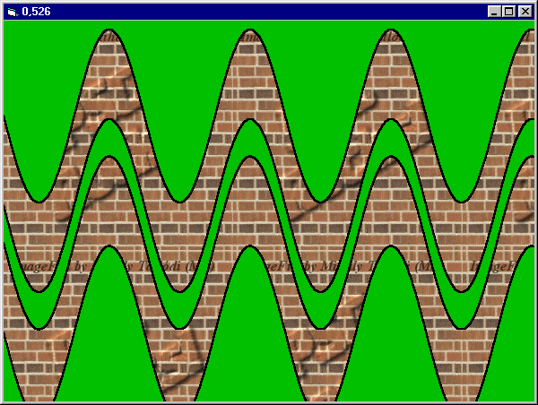



## Pure VB Image Floodfill

### Description

This code floodfills Forms, PictureBoxes (and everything with a hDC) with an image. Works every time, using a special workaround for Stack Overflow. For more description, see inside. *Corrected*
 
### More Info
 

             |
---                |---
**Submitted On**   |2003-10-02 18:12:18
**By**             |[Mihály Tallódi](https://github.com/Planet-Source-Code/PSCIndex/blob/master/ByAuthor/mih-ly-tall-di.md)
**Level**          |Intermediate
**User Rating**    |5.0 (10 globes from 2 users)
**Compatibility**  |VB 6\.0
**Category**       |[Graphics](https://github.com/Planet-Source-Code/PSCIndex/blob/master/ByCategory/graphics__1-46.md)
**World**          |[Visual Basic](https://github.com/Planet-Source-Code/PSCIndex/blob/master/ByWorld/visual-basic.md)
**Archive File**   |[Pure\_VB\_Im1655641082003\.zip](https://github.com/Planet-Source-Code/mih-ly-tall-di-pure-vb-image-floodfill__1-49093/archive/master.zip)

